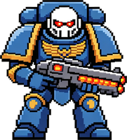

# Astartes Task Reminder 🛡️

A semi-transparent desktop task reminder with a Warhammer 40K Astartes (Space Marine) desktop pet. Built with Python + PyQt5.



## Features

- **Glassmorphism UI** — Semi-transparent frameless window with gradient accents
- **Astartes Pet** — Animated Ultramarine Space Marine with idle/wave/alert/happy states
- **Speech Bubbles** — Comic-style dialogue reacts to your actions
- **Task Management** — Add, complete, delete tasks with date & time
- **Calendar Filter** — Click any date to filter tasks from that day onward
- **Popup Reminders** — Floating notification window when a task is due
- **System Tray** — Minimize to tray, double-click to restore
- **Persistent Storage** — Tasks auto-save to JSON

## Quick Start

```bash
pip install pyqt5
python pet_reminder.py
```

Or double-click `启动宠物版.vbs` (Windows).

For the version without the pet: `python reminder.py` / `启动提醒.vbs`.

## Interaction Guide

| Action | Astartes Reaction |
|--------|-------------------|
| Click the Marine | Waves and shouts "The Emperor protects!" |
| Add a new task | Happy shake "A new quest!" |
| Reminder fires | Alert stance "Brother! A task awaits!" |
| Idle (every ~4s) | Random "For the Emperor!" / "Vigilance!" / "Brother!" |

## Project Structure

```
├── pet_reminder.py    # Main app with Astartes pet
├── reminder.py        # Lighter version (no pet)
├── 启动宠物版.vbs      # Windows launcher (pet version)
├── 启动提醒.vbs        # Windows launcher (clean version)
├── tasks.json         # Task data (auto-generated)
└── sprites/
    ├── idle.png       # Idle animation frame
    ├── wave.png       # Wave animation frame
    ├── alert.png      # Alert animation frame
    └── happy.png      # Happy animation frame
```

## Custom Sprites

Replace PNG files in `sprites/` with your own pixel art (transparent background recommended). Each file maps to an animation state — keep the same filenames or update `STATE_FRAMES` in `pet_reminder.py`.

Sprite prompt for AI generation:
> Pixel art sprite sheet, Warhammer 40k Space Marine Ultramarine, front view, blue armor gold trim, white helmet red eyes, chibi style, transparent background, 4 frames: idle/wave/alert/happy, RGBA PNG

## License

MIT — feel free to use, modify, and share.
